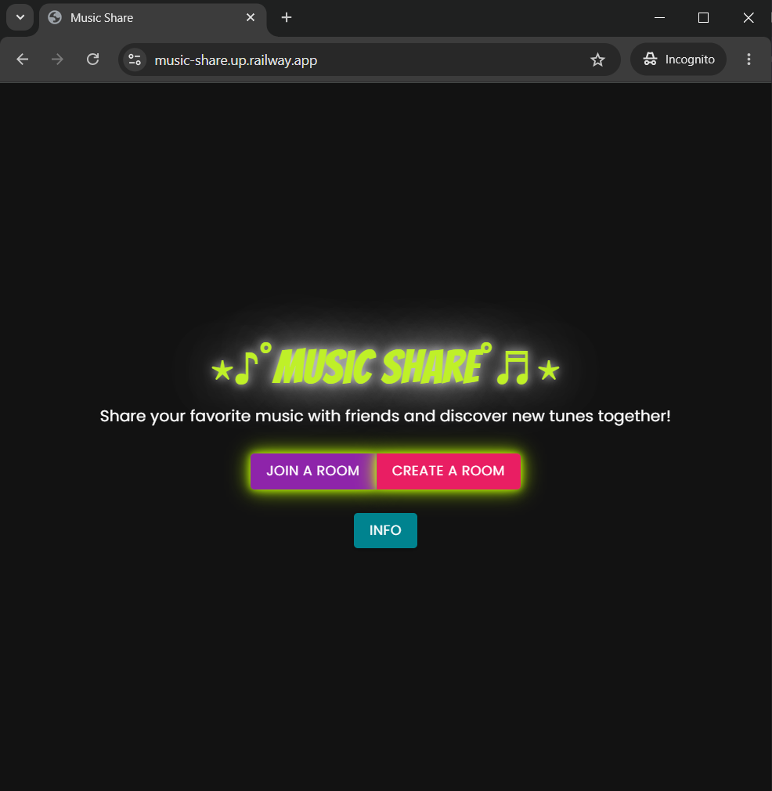
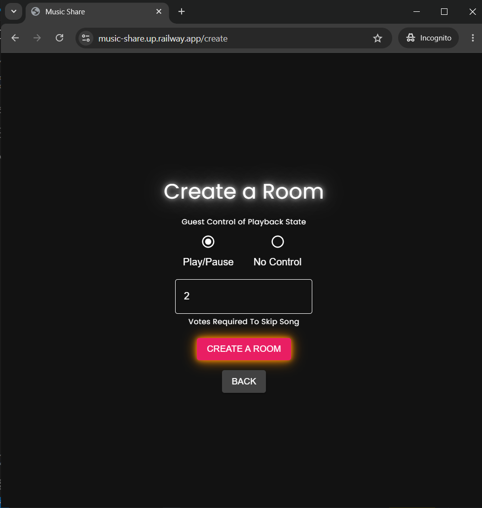
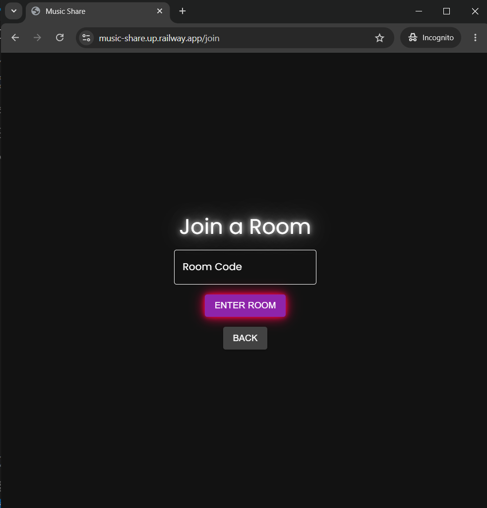
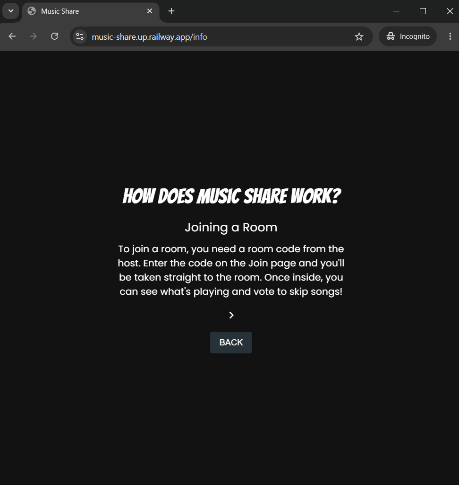
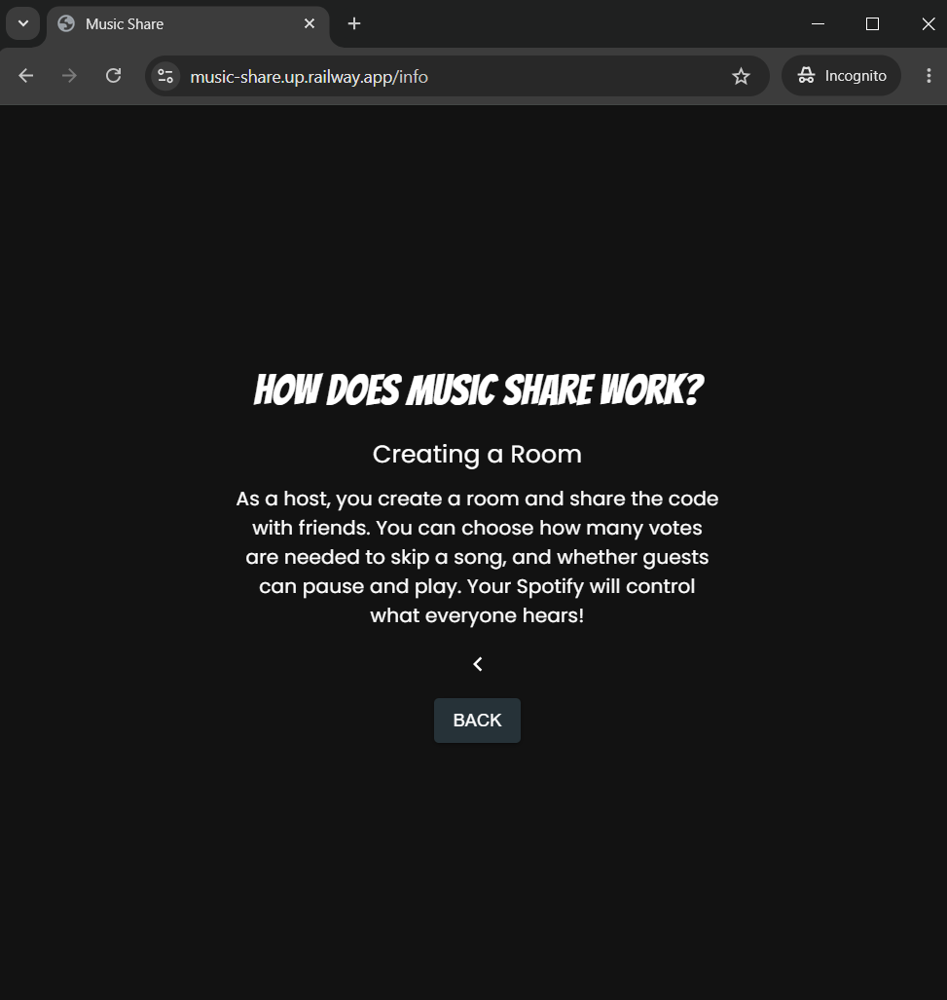
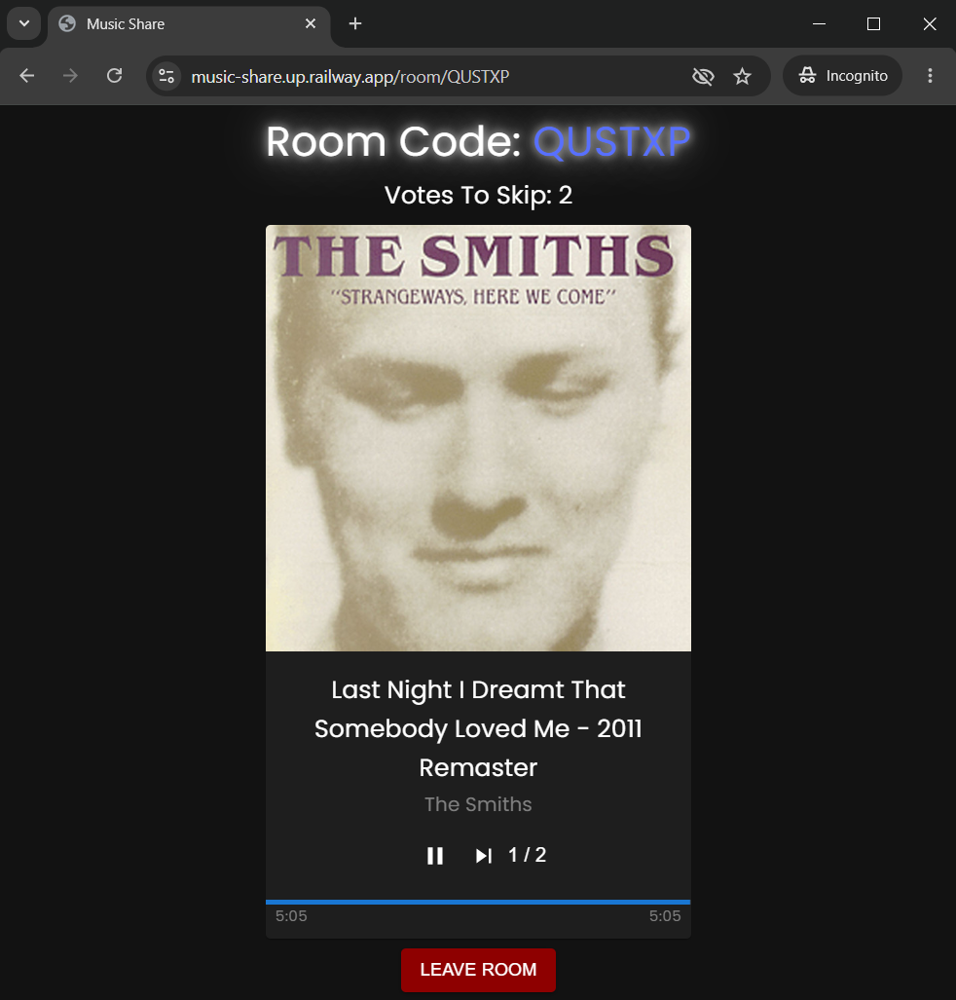
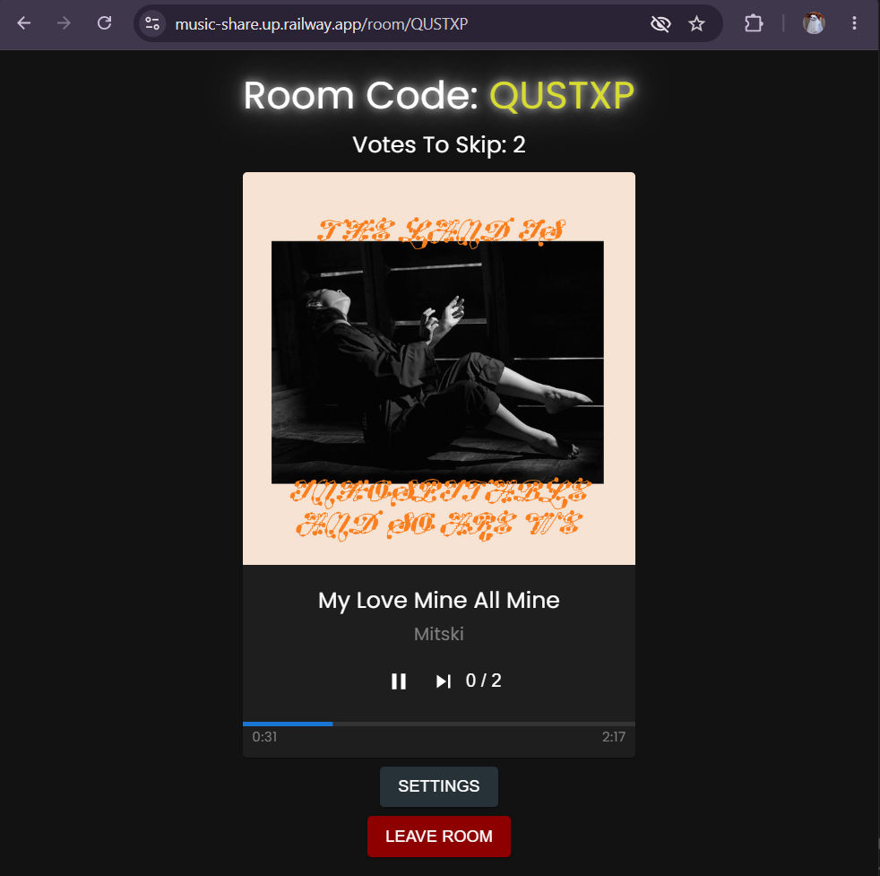
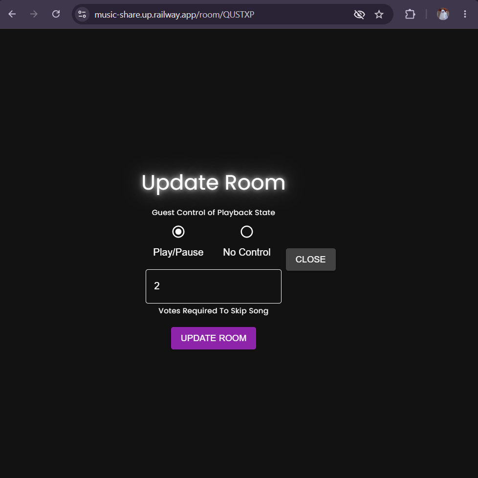

# 🎵 Music Share

A full-stack music sharing web app that lets groups of friends listen to Spotify together in real time. One person hosts a room, shares the code, and everyone can see what's playing, vote to skip songs, and control playback.

Built with Django, React, and the Spotify Web API.

---

## Features

- **Room system** — create a room and share a 6-character code with friends
- **Spotify integration** — displays the currently playing song with album art, artist, and progress in real time
- **Voting** — guests vote to skip songs; the host sets how many votes are needed
- **Playback control** — host (and optionally guests) can pause and play
- **Queue** — see the next 5 songs coming up
- **Guest count** — see how many people are in the room
- **Settings** — host can update room settings mid-session
- **Smooth UI** — page transitions, loading states, animated progress bar, and a dark music-themed design
- **Info page** — explains how the app works for new users

---

## Tech Stack

**Backend**
- Python / Django 6
- Django REST Framework
- Spotify Web API
- PostgreSQL (production) / SQLite (development)
- Gunicorn

**Frontend**
- React 19
- Material UI (MUI) v5
- Framer Motion
- React Router v7
- Webpack + Babel

**Deployment**
- Railway (backend + database)
- WhiteNoise (static files)

---

## How It Works

1. The host creates a room and authenticates with Spotify
2. The host shares the room code with friends
3. Guests join by entering the code
4. Everyone sees the currently playing song update in real time
5. Guests vote to skip — once enough votes are cast, the song skips automatically
6. The host can update room settings or leave, which closes the room

---

## Running Locally

### Prerequisites
- Python 3.10+
- Node.js 18+
- A Spotify Developer account with an app created at [developer.spotify.com](https://developer.spotify.com)

### Backend setup

```bash
git clone https://github.com/aylinasadi/music-share.git
cd music-share
pip install -r requirements.txt
```

Create a `.env` file in the project root:
```
SPOTIFY_CLIENT_ID=your_client_id
SPOTIFY_CLIENT_SECRET=your_client_secret
REDIRECT_URI=http://localhost:8000/spotify/redirect
SECRET_KEY=your_django_secret_key
ALLOWED_HOSTS=localhost,127.0.0.1
```

```bash
python manage.py migrate
python manage.py runserver
```

### Frontend setup

```bash
cd frontend
npm install
npm run dev
```

Then visit `http://localhost:8000`

### Spotify setup
In your Spotify Developer app settings, add `http://localhost:8000/spotify/redirect` as a redirect URI.

---

## Deployment

The app is deployed on [Railway](https://railway.app) with a PostgreSQL database.

Live demo: [music-share.up.railway.app](https://music-share.up.railway.app)

---

## Screenshots










---

## What I Learned

- Building a REST API with Django REST Framework and connecting it to a React frontend
- OAuth 2.0 authentication flow with the Spotify Web API
- Managing real-time data polling and state in React class components
- Deploying a full-stack Django app with PostgreSQL on Railway
- Handling cross-origin sessions, token refresh, and API rate limits

---

## Future Improvements

- WebSocket-based live chat between room members
- Mobile responsive design
- Song search and queueing from within the app
- Dark/light mode toggle